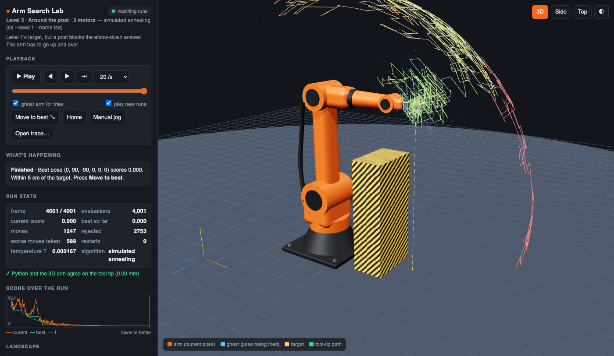

# DSU CSCI 558 · Arm Search Lab

*Hands-on labs for **CSCI 558 Nature Inspired Computing** at Delaware State University (DSU).*

**Teach a robot arm to find its target by trial and error, and watch how different search strategies succeed, get stuck, or escape.**



You write the search algorithm in Python. A 3D viewer in your browser replays every guess it made: the orange arm is where the search *is*, the see-through blue arm is the pose it's *trying*, and the coloured line traces where the gripper has been.

---

## What is this, in plain terms?

A factory robot arm has six motors, one at each joint: base, shoulder, elbow and three in the wrist. To pick something up, it needs the right **angle for every motor** so the gripper lands exactly on the object. Working out those angles is called **inverse kinematics**.

**Why not just calculate the answer?** For an arm with two joints you can, using the law of cosines from trigonometry. Lab 01 has you do exactly that. But add more motors, an obstacle in the way, or a rule like "the gripper must point straight down", and there's no neat formula any more.

**Why not try every possibility?** If each of the six motors can be set to any whole degree, there are 360⁶ ≈ **2 quadrillion** possible poses. Checking a billion poses per second would take about 25 days. That's for one target.

So instead we **search**: make a guess, score it, and use the score to make a better guess. That's the subject of this project and of Chapter 3 of our textbook.

## The big idea: a landscape you can't see

Give every possible pose a **score**: how far the gripper ends up from the target. Lower is better, and 0 means you've hit it exactly.

Now picture all those scores as a landscape. Every pose is a spot on the map, and its score is the height of the ground there. Finding the best pose means finding the **lowest point** on the map.

The catch is that you're standing on it **in thick fog.** You can only feel the ground right around your feet: you can test a few nearby poses, but you can't see the whole map. Every search algorithm is a strategy for walking in that fog:

- **Hill-climbing:** always step to whichever nearby spot is lowest. It's fast and simple, but when every step around you goes up, you stop, even if you're in a small dip halfway up a mountain. That dip is a **local optimum**. The true lowest point is the **global optimum**.
- **Restarts:** walk downhill from several random places and keep the best result.
- **Stochastic hill-climbing and simulated annealing:** *sometimes* take a step **uphill** on purpose, so you can climb out of a small dip and find a deeper one.
- **Genetic algorithm:** send out a whole crowd of walkers, keep the ones that end up lowest, and combine their "directions" to make the next crowd.

For the two-motor level, the viewer actually **draws the landscape**: a heat map of every possible pose, with the path your search took drawn on top. You can watch hill-climbing get stuck in a dip you can see.

---

## How this ties to Chapter 3

Our textbook is *Fundamentals of Natural Computing* by Leandro de Castro. Chapter 3, "Evolutionary Computing", treats problem solving as a **search**, then builds up from the simplest search method to ones inspired by evolution. This project follows the same path. The book uses a curvy one-variable function, g(x); here the same algorithms move a robot arm.

| Chapter 3 | What the book says | Where you'll see it here |
|---|---|---|
| **3.2 Problem solving as a search task** (p. 62) | Every search needs a *representation* (what a candidate answer looks like), an *objective* (what you want), and an *evaluation function* (how good a candidate is). | **Representation:** six motor angles. **Objective:** put the gripper on the target. **Evaluation:** distance to the target, plus a penalty for hitting things. Every lab is built on these three. |
| **3.3.1 Hill climbing**, Algorithm 3.1 (pp. 65–66) | Keep moving to a better neighbouring point until none is better. | Lab 01, Step 4. Recorded examples 1–3 show it getting stuck, including a surprise: the *way you define a "neighbour"* can create dead ends. |
| **Iterated hill climbing**, Algorithm 3.2 (pp. 66–67) | Run hill-climbing from many random starting points and keep the best. | Lab 01, Step 6 and example 5. This turns out to be one of the strongest methods here. |
| **Stochastic hill climbing**, Algorithm 3.3 (p. 68) | Accept a *worse* point with some probability, controlled by a "temperature" T. | Lab 01, Step 7 and example 6. The viewer counts **worse moves taken** and explains each one. |
| **3.3.2 Simulated annealing**, Algorithms 3.4–3.5 (pp. 68–71) | Start with a high temperature and cool it down slowly, like hardening metal: lots of wandering early, careful steps late. | Lab 01, Step 8 and examples 7–9. The dashed line in the score chart is the temperature cooling. |
| **3.4–3.5 Evolution and genetic algorithms** (pp. 73–99) | A population of candidates, encoded as bit strings, improved by selection, crossover and mutation. | Lab 01, Step 11 (stretch): the six angles become a 48-bit "chromosome". |
| **3.5.4 Comparing hill climbing, annealing and GAs** (p. 99) | The random methods can escape local optima "due to their stochastic nature". The book compares them to kangaroos looking for Mount Everest. | Lab 01, Part E: you compare every method fairly on the same levels and seeds. |

The book's kangaroo comparison (from Sarle, 1993, quoted on p. 99) is the whole project in one picture:
- In **hill-climbing**, a kangaroo hops uphill and stops at the top of whatever hill it started on.
- In **simulated annealing**, "the kangaroo is drunk and hops around randomly for a long time", then gradually sobers up.
- In a **genetic algorithm**, lots of kangaroos are dropped in at random, and the ones that end up low are removed each generation, so the survivors are the ones that climbed high.

(The book climbs *up* to the highest point; we go *down* to the lowest score. It's the same idea upside down.)

**Lab 00's bonus step is the one exception.** It uses *gradient descent*, which isn't in Chapter 3: it needs the *slope* of the landscape, not just the score at each point. It's included as a contrast. The companion textbook, Eberhart and Shi's *Computational Intelligence* (Chapter 3), points out that evolutionary methods use the score directly, "instead of function derivatives", so they still work when the slope isn't available.

---

## What you'll discover

Without giving away the answers, here are three lessons the labs are built around:

1. **How you define a "step" matters as much as the algorithm.** If hill-climbing may only move one motor at a time (10° per step), it gets stuck 35 cm from the target, in open space, with nothing in the way. Let it move two motors at once and it walks straight there.
2. **Simple can beat clever.** Restarting plain hill-climbing from random places often beats simulated annealing. On the "around the post" level it succeeded in 19 of 20 runs, against annealing's 7 of 20.
3. **There's no best algorithm, only a best algorithm for a given landscape.** On the six-motor level, change how much the score cares about the gripper's angle and the winner flips: annealing goes from losing to winning.

And one you'll see for yourself: the arm sometimes reaches **backwards over its own head**, 17 cm short of the target. It's a near miss that's very hard to escape. Watch recorded example 8 to see it.

---

## Words you'll see

| Word | Meaning |
|---|---|
| **Pose** | One setting of all six motor angles, e.g. (0°, 90°, −90°, 0°, 0°, 0°). One point on the landscape. |
| **Joint / motor** | A place where the arm bends or turns. A1 is the base, A2 the shoulder, A3 the elbow, A4–A6 the wrist. |
| **Forward kinematics** | Angles → where the gripper ends up. Easy: just trigonometry. The project does this for you. |
| **Inverse kinematics** | Where the gripper should go → which angles. Hard. This is what the searches solve. |
| **Score** (evaluation function) | How bad a pose is: distance to the target in metres, plus penalties. Lower is better. |
| **Neighbour** | A pose that's one small step away, such as one motor turned 1°. |
| **Local optimum** | A pose where every neighbour is worse, but which isn't the best overall: a dip, not the valley floor. |
| **Global optimum** | The best pose of all. |
| **Temperature (T)** | In stochastic methods, how willing the search is to accept a worse step. High T means adventurous; low T means cautious. |
| **Seed** | The starting number for the random-number generator. The same seed gives the same "random" run, so results can be repeated and compared. |
| **Trace** | A saved recording of one search run, which the viewer replays. |

---

## Try it

You need **Python 3.8 or newer** (nothing to install) and a web browser with internet access.

```bash
git clone https://github.com/code-rhino/dsu-csci558-nature-inspired-computing-labs.git
cd dsu-csci558-nature-inspired-computing-labs
python3 -m viewer          # window 1: opens the 3D viewer in your browser. Leave it running.
python3 -m viewer.demo     # window 2: the arm waves each motor. If you see that, it works.
```

Then pick a lab:

| Lab | What it is | You write |
|---|---|---|
| **[00 · Start here](labs/00-start-here/README.md)** | Type along: every line of code is in the README. In about 45 minutes you make the arm move, score its poses, write a random search and measure it, with gradient descent as a bonus. | `my_first_search.py`, by following the page |
| **[01 · Reach search](labs/01-reach-search/README.md)** | The Chapter 3 lab: hill-climbing, restarts, stochastic hill-climbing, simulated annealing, and a genetic algorithm as a stretch goal. Eleven steps, each with a by-hand exercise, a test, and a way to watch it. | `climb.py` |
| [Recorded runs for lab 01](labs/01-reach-search/examples/README.md) | Nine saved runs of a finished lab 01 that you can watch before you start. | nothing |
| **[02 · Genetic algorithm](labs/02-genetic-algorithm/README.md)** | Evolve poses: binary chromosomes, roulette selection, crossover, mutation, elitism. The viewer draws the whole population at once. Eight steps, plus experiments that compare it against lab 01. | `ga.py` |

**Coming next**, in the same order as the course: evolution strategies, particle swarms, ant-colony path planning, a neural network that learns to reach, and a fuzzy controller. Each comes with its textbook reading; see the **[roadmap](docs/ROADMAP.md)**.

**Every lab starts with a "Read first" table** listing the textbook sections and pages to review before you begin.

**About answers:** the labs give you starting code, tests and hints, not solutions. If your class uses these exercises for credit, follow its rules on collaboration and AI help, and don't post your finished files publicly.

**For the technical details** (how the code is organised, the arm's exact measurements, every viewer feature, how to add your own lab, and troubleshooting), see the **[project guide](docs/GUIDE.md)**.

---

MIT licensed: see [LICENSE](LICENSE). Textbook references are to de Castro, *Fundamentals of Natural Computing* (2006), and Eberhart & Shi, *Computational Intelligence: Concepts to Implementations* (2007); page numbers only, no book content is included beyond short quotes.
